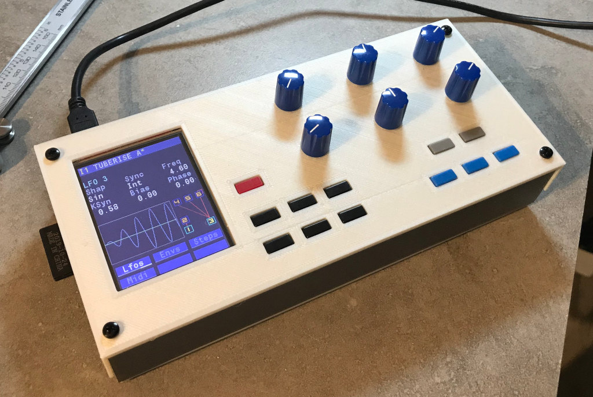
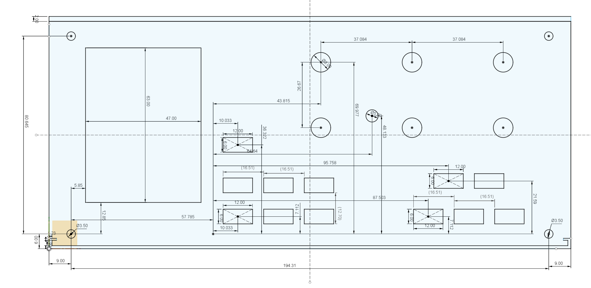
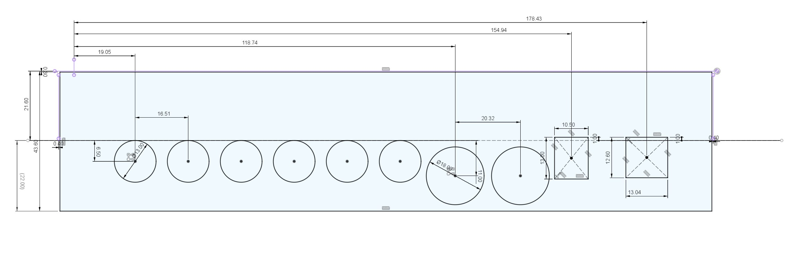

# 3D printed case

This is the case you can see at the bottom of the [build wiki](https://github.com/Ixox/preenfm3/wiki/Build)  

  

If you used 6mm spacer between the main and the control board, you have to print the slim version of the front and rear part.  
. Top.stl  
. bottom.stl  
. front_slim.stl  
. Rear_slim.stl  

Use regular front and Rear if you used 12mm spacers between the control and the main board (previous version of the build).

Usefull dimensions if you want to build your own case : 

  

On the picture bellow, the 21.6mm dimension on the left (from top line to middle line) is for the build with 12mm between control and main board.  
So if you used 6mm this dimension will be 21.6 - 6 = 15.6mm.  

