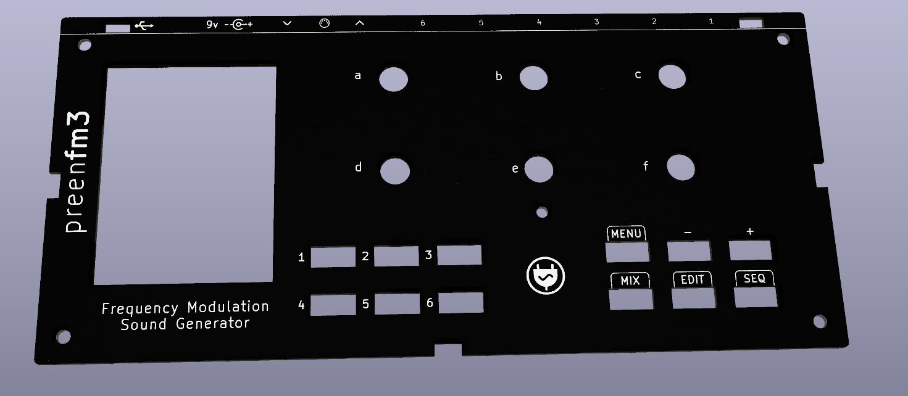

# Preenfm3 2022 Case : 3D print + PCB

This enclosure for the preenfm3 is made from 2 3D printed pieces plus a PCB for the top surface.  

The following is required to mount the enclosure.   
You can use M2.5 or M3.  
* 2 x 15mm M/F for the lower front spacers  
* 2 x 20mm M/F for the lower rear spacers  
* 4 * 14mm M/M sapcers for the up spacers (between main PCB and top surface)  
* 5 * 6mm M/F for the spacers between control board and main PCB  

You'll also need  
* 8 * 6mm screws (Top and bottom screws)  
* 5 * 4mm screws (to secure the control board / 6mm can also work)  
* 5 * nuts bottom of the PCB (for the 5 * 6mm M/F spacers)  
* Optionaly 4 case feet to stick on the bottom of the 3D printed case

Kicad files are in the topsurface sub folder.   
Use top surface v2 if you have a surface control v2.

Topsurface v1.x  

Topsurface v2.x  

The 2 stl files are in this folder  

The result of the v1 will look like this

