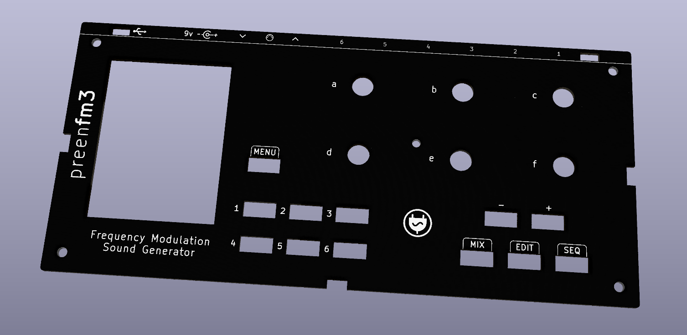
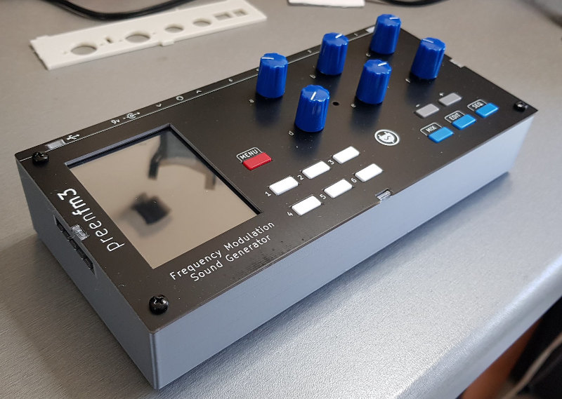

# Preenfm3 2021 Case : 3D print + PCB

This enclosure for the preenfm3 is made from 2 3D printed pieces plus a PCB for the top surface.  
You can find everything in this folder.  

Kicad files are in the topsurface sub folder  

The 2 stl files are in this folder  

The result can look like this depending of your components (PCB color, 3D filament color, button etc..)

